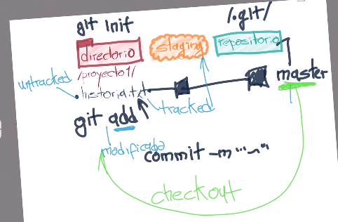
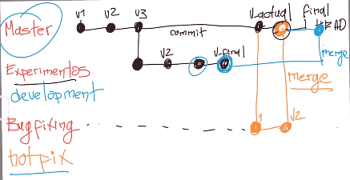
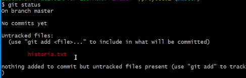
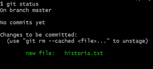
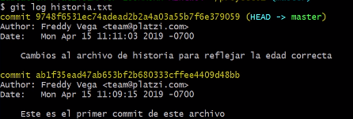
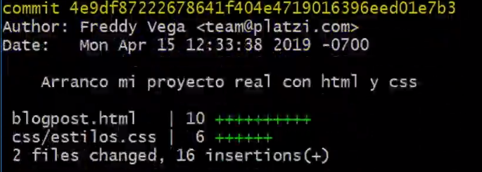
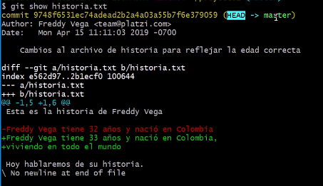

# Git & GitHub

## What is Version Control System?

A version control system is a database that stores changes over files in a specified directory. There are multiple version control systems, the most known one is Git.

## Basic Commands to work on Git

To initialize a git repository:

```shell
git init
```

When initialized the repo, every change in a file that wants to be versioned leads to be added with:

```shell
git add <filename>
```

If all changes in all files want to be saved, the `.` keyword from Shell can be used instead:

```shell
git add .
```

Then the changes must be commited with a comment:

```shell
git commit -m "This explains the change done"
```

To see the repo status (if there is any unstaged change):

```shell
git status
```

To push the changes to a remote repository:

```shell
git push
```

## Binary files and Plain text files

Files with plain text are files that only contains unformatted text. They can be written by notepad, nano editor, and any other text editor like VS Code or Sublime, these ones are also text editors but especially made to edit code.

Binary files are files that are encoded into a binary system, so they can not be read by any of the mentioned applications.

**Important**: Git and GitHub take version control of only plain text files. It means that if an image or any other binary file is stored in a repository, Git won't keep track of changes made to it. GitHub allows the cloud storage of the file, but it doesn't trace their changes either.

## Basic Work Cycle in GitHub

Once a directory is created to start the project, the command `git init`does the following things:

1. A space in RAM memory is created and it is called `staging`. The changes are initially made in this area.
2. It creates a directory called `.git` inside the project's directory.

The command `git add <filename>` does the following:

1. The file is stored in the `staging` area, waiting to be commited.

   At this point, it is possible to:

   1. Add more changes with `git add`
   2. Remove staged changes with `git rm`

The command `git commit -m "<comment>"` does the following:

1. The changes in the `staging` are moved to the repository in the `.git`directory.



## Branching and Merging

By default, the current branch is called the `master` branch. As many versions can be created as wanted. Sometimes it is wanted to try some idea, so a new branch can be created parallel to master to add this feature. It is called a `experiments` branch.

If a bug is found in the `master` branch, a `hotfix` is needed, so a new branch can be created with that name. When the bug is fixed, then `git merge` must be called to merge the `hotfix` branch to the `master branch`. If the `experiments` branch is done, then it also gets merged with the `master` branch.



## Setting Up Git

### Local Credentials

Git needs credentials to author the commits. The credentials are the Name and Email of the Person who is commiting changes. To add this values, the following must be done on Shell:

```shell
git config --global user.name "<your_name>"
git config --global user.email "your@email.com"
```

To check if the credentials were stored:

```shell
git config --list
```

In the list of parameters, `user.name` and `user.email` must be there.

## Git Config

This command deals with all the configuration parameters that Git needs.

Show all the existing configuration parameters:

```shell
git config --list
```

Show the path where the configuration parameters are stored:

```shell
git --list --show-origin
```

Change the value of a configuration parameter:

```shell
git config --<param_name> <new_value>
```

## Git Add

This will move the changes to the `staging` area allocated in the RAM Memory.

Add the changes of a specified file:

```shell
git add <filename>
```

Add the changes of all files:

```shell
git add .
```

## Git Commit

This will move the changes from the `staging` area to the database in the `.git`directory. It is very good practice to always give descriptive comments summarizing the changes.

Commit staging changes:

```shell
git commit -m "<comment>"
```

## Git Status

This will return the status of the repo, it will list the files that have untracked changes, or will tell if there is nothing to commit.

```shell
git status
```



After adding some changes with `git add`, this will be the new status:



If the changes are commited, this will be the new status:

## Git Log

This shows the history of commits.

For a specified file:

```shell
git log <filename>
```



Every log element shows the author credentials, date, commit message and the tag (this really long id number of each commit).

This shows more details about every commit.

```shell
git log --stat
```



## Git Show

This shows the most recent change

For a specified file:

```shell
git show <filename>
```



## Git Diff

This shows all the changes between two specified commits:

```shell
git diff <commit1_id> <commit2_id>
```

This shows all the changes between current directory and staged files:

```shell
git diff
```

## Git Reset

This lets go back to some previous commit version. There is a hard and soft mode. The hard mode restores everything to the specified commit; the soft mode restores everything in the directory but doesn't restore the `staging` area.

```shell
git reset <commit_id> --hard
```

The hard reset is an agressive way to go back in the past. All the commits after the one specified will be deleted, and there will be no way to go back to the previous `head` version.

```shell
git reset <commit_id> --soft 
```

## Git Checkout

This lets bring back some previous commit of a specified file:

```shell
git checkout <commit_id> <filename>
```

If all files from previous commit want to be brought back:

```shell
git checkout <commit_id>
```

To go back to the current branch:

```shell
git checkout <branch_name> <filename>
```

